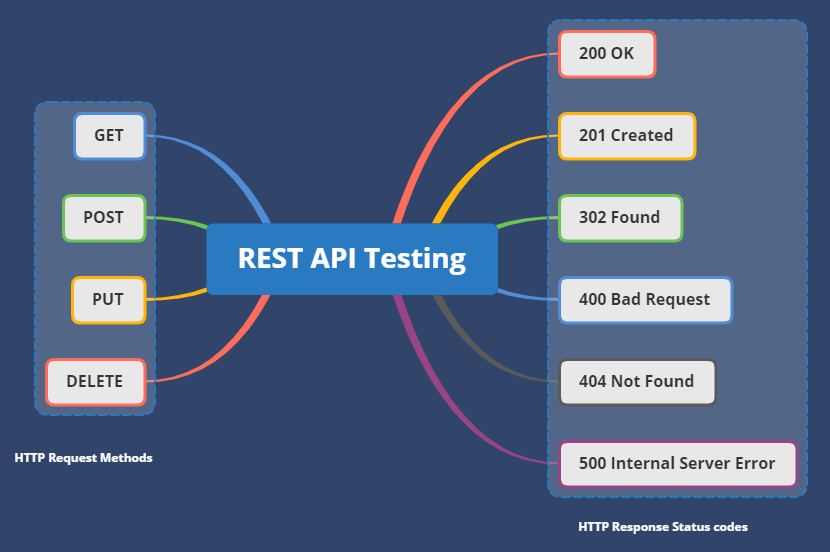

# API Nedir ?

    API (Application Programming Interface) dilimize göre anlamı “Uygulama Programlama Arayüzü”, uygulamanın işlevlerine\
    dışarıdan veya uzaktan erişilerek bu işlevlerin kullanılmasını sağlayan bir arayüzdür. API, bir sunucunun, uygulamaya
    farklı platformlardan ulaşmasına ve yanıt vermesine olanak sağlar.
    
    API kullanımının asıl amacına değinmek gerekirse bir uygulamanın tüm ya da bazı metodlarını diğer uygulamalara açarak
    dışardan gelecek veri ve bilgi isteklerini hızlı ve rahat bir şekilde cevaplamaktır.

    

### API’nin Kullanıldığı Başlıca Platformlar

    · Uygulama Sunucuları
    
    · Bulut Kaynakları
    
    · Bulut Tabanlı Servisler
    
    · Mobil Uygulamalar
    
    · Database
    
    · Web Uygulamaları

### API Tipleri

#### REST (Representational State Transfer / Temsili Durum Transferi) API

    Client (istemci) ve server (sunucu) arasında hızlı ve kolay şekilde iletişim kurulmasını sağlayan bir servis yapısıdır. Diğer bir tanımla, yazılımlarda kullanılan bir veri transfer yöntemidir.
    Genellikle mesajlar XML veya JSON formatlı gönderilir. Ama bazı zamanlarda text olarak da gönderim sağlanabilir.

#### SOAP ( Simple Access Protocol / Basit Nesne Erişim Protokolu) API

    Temel anlamda, internet üzerinde belirli bilgileri ya da mesajları aktarma protokolüdür. SOAP API’lerde genel olarak “HTTP” protokolü kullanılır. Kimi zamanlarda da “TCP/IP” protokolü kullanılır.
    SOAP API’lerde mesajlar XML formatlıdır. SOAP API’ler genel olarak kurumsal projelerde tercih edilir.

### REST Servis HTTP Metodları

#### GET

    Veri listeleme ve veri görüntüleme için kullanılır. GET request’ler güvenli olmalıdır. Aynı parametrelerde tekrar edilmesine bakılmaksızın sonuçlar hep aynıdır. GET ile veri gönderimi adres çubuğunda gönderildiğinde sonuçlar görülebilir olduğundan güvenilir değildir.

#### POST

    Veri eklemek için kullanılmasının yanında mevcut olan veriyi güncellemek için de kullanılır. Doğrudan sayfaya veri gönderilir ve veriler adres çubuğunda gösterilmez.

#### PUT

    Verileri güncellemek için kullanılmaktadır. PUT’un POST’tan farkı etkisiz olmasıdır. Yani bir istek birden fazla olsa da sonucu değişmez. Varolan veriyi günceller ya da üzerine veri ekler.

#### PATCH

    Verinin sadece bir parçasını güncellemek için kullanılır.

#### DELETE
    
    Kaynaktan veriyi silmek için kullanılır. Ancak ID’si verilen bir veriyi silebiliriz.

#### OPTIONS

    Kabul edilen istekler doğrultusunda bilgi iletilir.

### HTTP durum kodları
- HTTP protokolü HTTP yöntemlerinde olduğu gibi çeşitli HTTP durum kodlarına sahiptir.
- HTTP durum kodları işlem sonucu ile ilgili bilgi almak için kullanılır.

    Örneğin; Web tarayıcıdan herhangi bir siteye ait web sayfasına girildiğine HTTP durum kodu 200 olacaktır. 
    Web sayfası veya dosya sitede yoksa HTTP durum kodu 404 olacaktır.
    Aşağıdaki HTTP durum kodları, yaygın olarak REST tabanlı mimaride kullanılır.

    200 OK – İşlem başarıyla gerçekleşirse kullanılır.
    201 CREATED – İşlemi başarıyla gerçekleşirse kullanılır. Eklenen veri döndürülür.
    204 NO CONTENT – İşlemi başarıyla gerçekleşirse kullanılır. Eklenen, silinen veri döndürülmez.
    400 BAD REQUEST – Hatalı istek veya yetkilendirme hatası için kullanılır.
    401 UNAUTHORIZED – Yetkilendirme hatası için kullanılır.
    403 FORBIDDEN – Yetkilendirme ve erişim hatası için kullanılır.
    404 NOT FOUND – İstenilen işlem yoksa kullanılır.
    405 METHOD NOT ALLOWED – İzin verilmeyen HTTP yöntemi kullanıldığında bilgi vermek için kullanılır.
    409 CONFLICT – Aynı veri üzerinde birden fazla kişinin işlem yaptığını bildirmek için kullanılır.
    500 INTERNAL SERVER ERROR – Sunucuda herhangi bir hata olduğunda kullanılır.7

    

### API TESTİ

    API testi , işlevsellik, güvenilirlik, performans ve güvenlik beklentilerini karşılayıp karşılamadıklarını belirlemek 
    için uygulama programlama arabirimlerini doğrudan ve entegrasyon testinin bir parçası olarak test etmeyi 
    içeren bir tür yazılım testidir .

### API TESTİ TÜRLERİ

    

    Birim testi - Bireysel işlemlerin işlevselliğini test etme.
    
    İşlevsel testler - Genellikle uçtan uca testler için yapı taşları olarak birim testleri kullanarak daha geniş senaryoların işlevselliğini test etme. 
    Test senaryosu tanımı, yürütme, doğrulama ve regresyon testini içerir .
    
    Yük testi - Genellikle işlevsel test senaryolarını yeniden kullanarak yük altında işlevselliği ve performansı doğrulama.
    Çalışma zamanı hatası algılama - Yarış koşulları, istisnalar ve kaynak sızıntıları gibi sorunları ortaya çıkarmak için 
    bir uygulamanın otomatik veya manuel testlerin yürütülmesini izleme.
    
    Güvenlik testi - Penetrasyon testi ve fuzz testinin yanı sıra kimlik doğrulama, şifreleme ve erişim kontrolünün doğrulanmasını içerir.
    
    Web UI testi - API'leri de kapsayan uçtan uca entegrasyon testlerinin bir parçası olarak gerçekleştirilen, ekiplerin GUI öğelerini daha büyük işlem 
    bağlamında doğrulamasını sağlar.
    Birlikte çalışabilirlik testi - (yalnızca SOAP) Web Hizmetleri Birlikte Çalışabilirlik profillerine uygunluğun kontrol edilmesi .
    
    WS-* uyumluluk testi - (yalnızca SOAP) WS-Addressing, WS-Discovery, WS-Federation, WS-Policy, WS-Security ve WS-Trust gibi WS-* standartlarına uygunluğun kontrol edilmesi.
    
    Sızma testi - bir saldırganın yararlanabileceği güvenlik açıklarını bulmak için bir bilgisayar sistemini, ağı veya Web uygulamasını test etme.
    
    Bulanıklık testi - bazen "gürültü" veya "tüylenme" olarak adlandırılan büyük miktarda tamamen rastgele veri, zorunlu bir çarpışma, taşma veya diğer olumsuz 
    davranışları denemek için sisteme zorla girilir. Bu, API'yi mutlak sınırlarında test etmek için yapılır ve bir şekilde "en kötü durum senaryosu" olarak hizmet eder.

Yararlı Linkler

[API ve API testi nedir?](https://medium.com/kuka-mobile-tech/api-ve-api-testi%CC%87-nedi%CC%87r-4227fc99313f)
[BTK AKADEMI - API ve API Testi](https://www.btkakademi.gov.tr/portal/course/api-ve-api-testi-12025)
[Wikipedia API Testing](https://en.wikipedia.org/wiki/API_testing)
[Katalon API Testing](https://katalon.com/api-testing)

