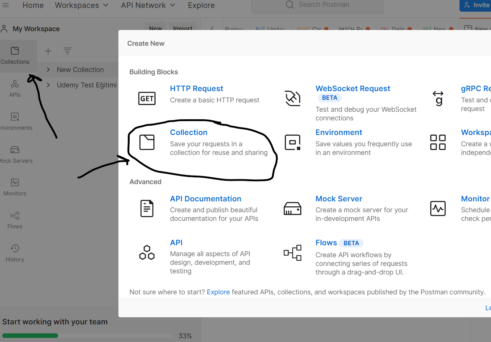
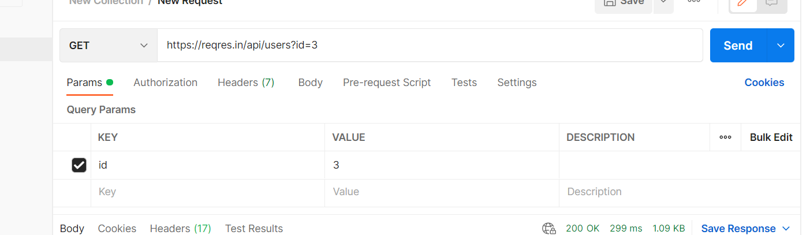
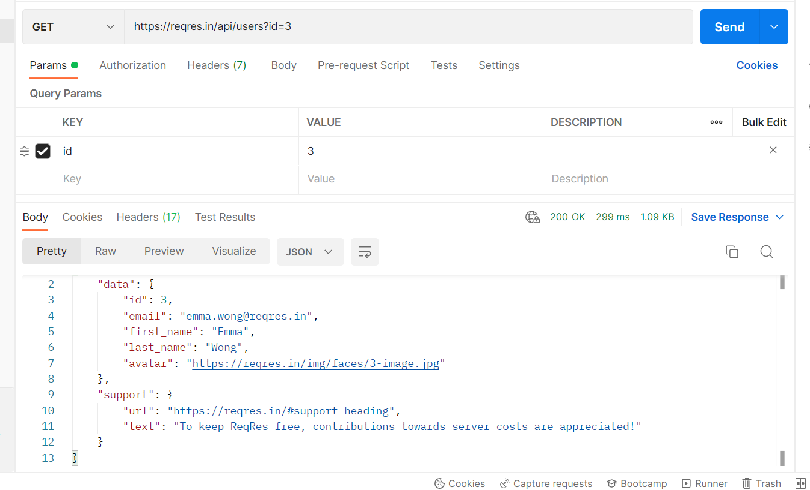
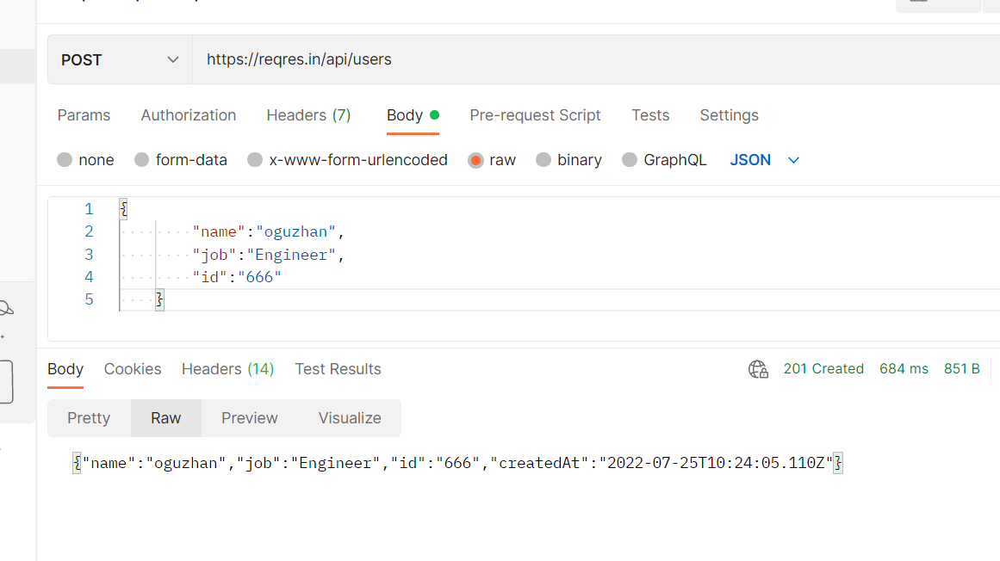
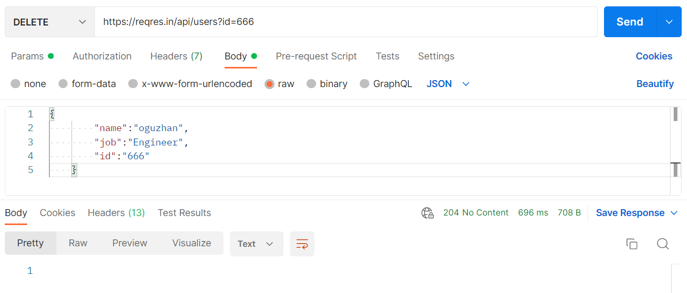
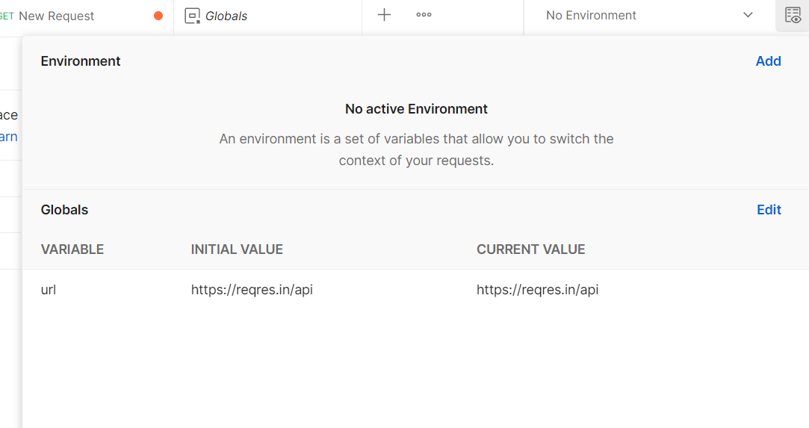
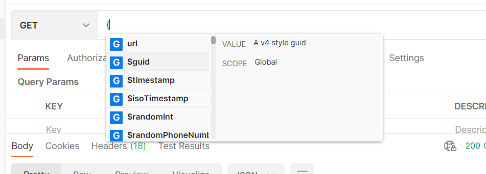
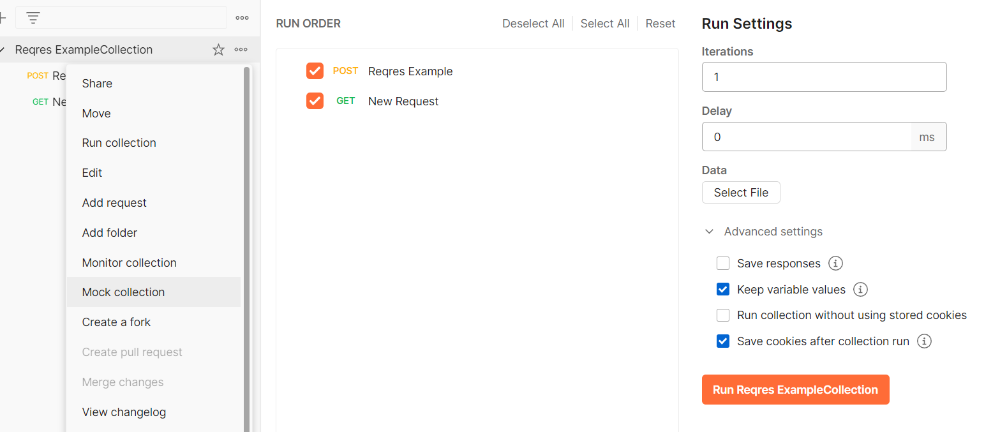

 # POSTMAN ILE API TESTİ
 

 Postman kurulum adımlarını tamamladıktan sonra yeni bir collection oluşturalım ve request ekliyelim.

Enter the request URL kısmına çalışacağımız link'i ekleyelim
        
        https://reqres.in/api/users?id=3

GET methodumuzu seçtikten sonra send butonu ile etkileşime girdiğimizde body kısmında sorgumuzun JSON formatlı çıktısını görmüş olucağız.

POST methodu ile apimizde veri oluşturalım

DELETE methodumuz ile oluşturduğumuz veriyi silebiliriz.

Global bir değişken oluşturalım ve ismine URL diyip url'imizi içine atalım.

Enter request URL kısmına gelip süslü parantez yazdığımızda "{" oluşturulmuş tüm variableları görebiliriz

Oluşturduğumuz tüm sorguları otomatize koşmak için Collection kısmında run collections seçeneği ile yapabiliriz.

 

