# SOAP UI TEST ARACI ILE API TESTİ

Yararlı Linkler

[BTK Akademi - API ve API Testi](https://www.btkakademi.gov.tr/portal/course/api-ve-api-testi-12025)\
[SoapUI WebSite](https://www.soapui.org/getting-started/)\
[SoapUI learn](https://www.soapui.org/learn/)\
[SoapUI Soap and WSDL](https://www.soapui.org/docs/soap-and-wsdl/)
[reqres.in/api](https://reqres.in/api/users?page=2)

- ## Öncelikle [SOAPUI](https://www.soapui.org/) web sitesinden uygulamamızı indirelim ve kurulumunu yapalım.
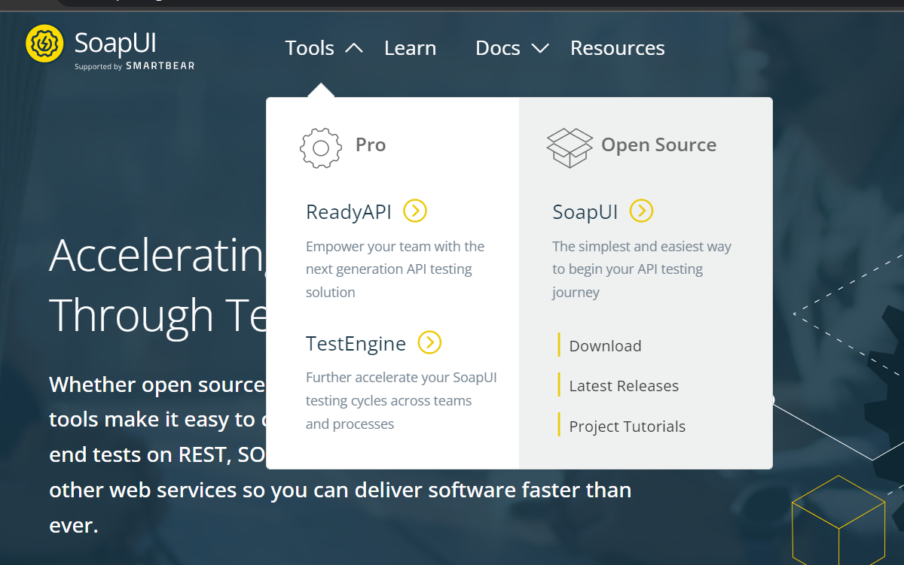
- ## Yeni bir SOAP projesi oluşturalım.
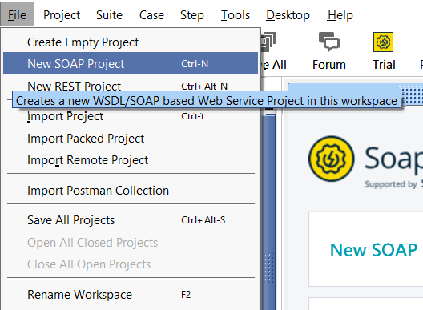
- ## Açılan pop-up'ın wsdl kısmına soapui [website](https://www.soapui.org/getting-started/soap-test/)sinde verilmiş olan url'i yapıştıralım, ardından projemize bir isim verelim ve ok butonuna basalım.
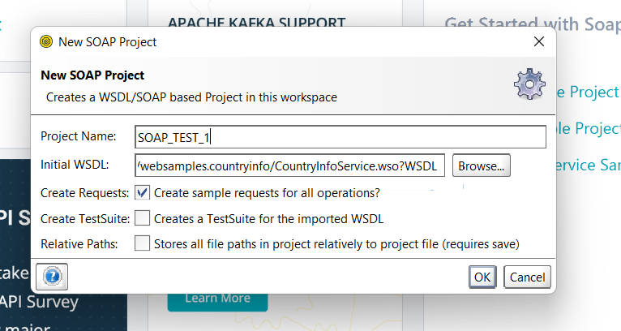
- ## Resimde görüldüğü gibi wsdl içerisinde ki tüm metotlar yan tarafa gelmiş oldu.

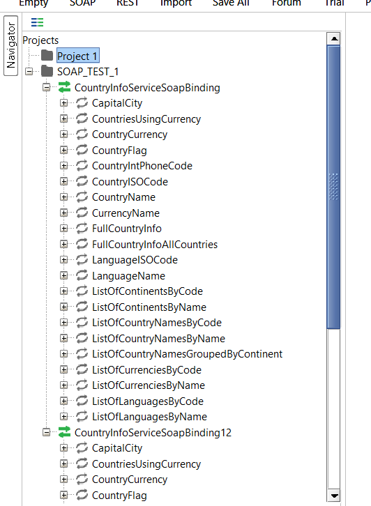
### CountryName methodunda request 1'e çift tıkladığımzı da ülke isimleri için sorgu yapabiliriz fakat, CountryISOCode'a ihtiyacımız var
### CountryISOCode methodundan ülke ismini ingilizce yazarak iso codelarına ulaşıp sorgu yapabiliriz.
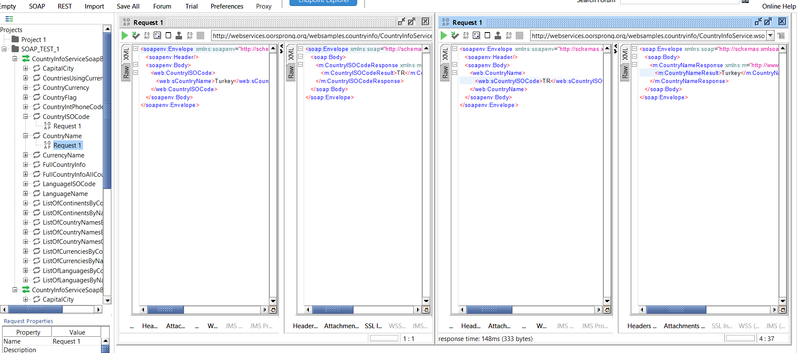

[reqres](https://reqres.in/) websitesi'ni kullanarak sorgu yapalım...

### REST projesi oluşturalım ve http methodlarımızı deneyelim.
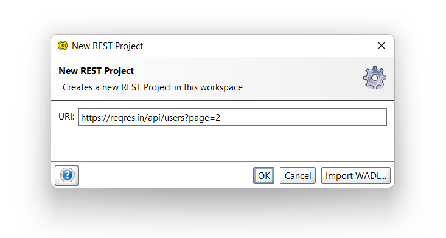
- #### GET metodu ile kullanıcıları json formatında çağıralım
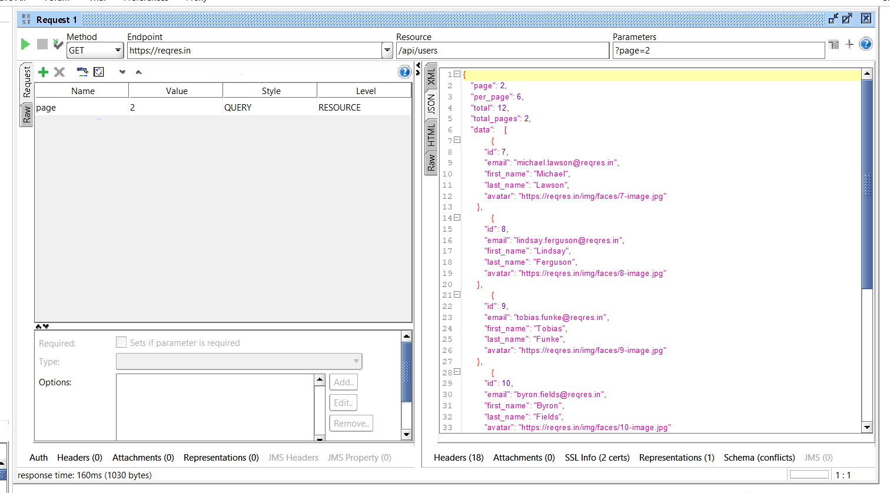
- #### POST metodu ile yeni kullanıcı ekleyelim
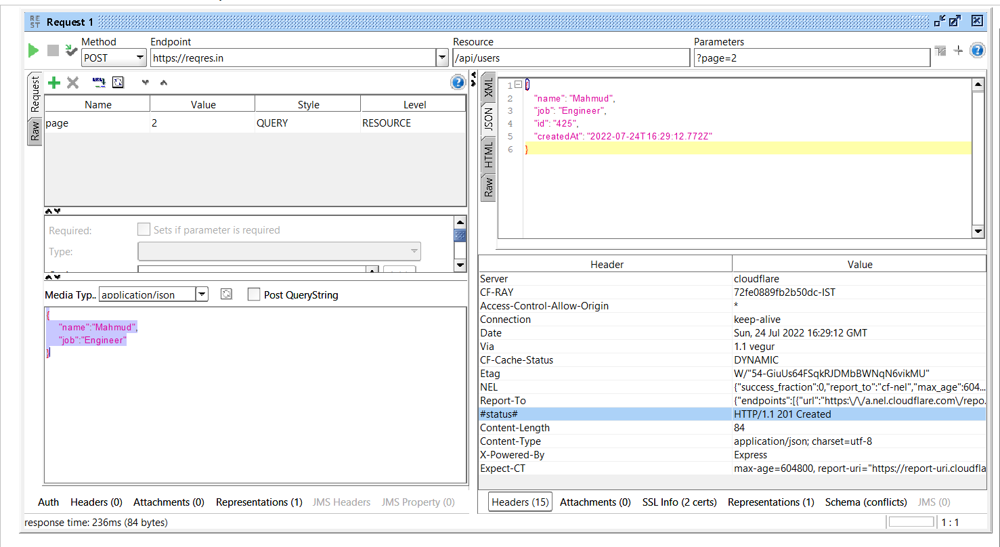 

        Not: JSON formatta mutlaka nitelikler arası virgül olmalıdır.
- #### PUT metodu ile oluşturduğumuz kullanıcıların bilgilerini güncelleyebiliyoruz.

- #### Login işlemi deneyelim

url kısmına "https://reqres.in/api/" /login yazarak requestimizi oluşturalım.
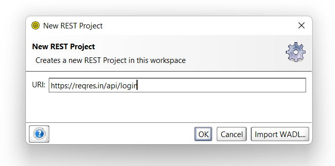
hemen ardından GET methodu ile bir kullanıcının email bilgisini alalım..
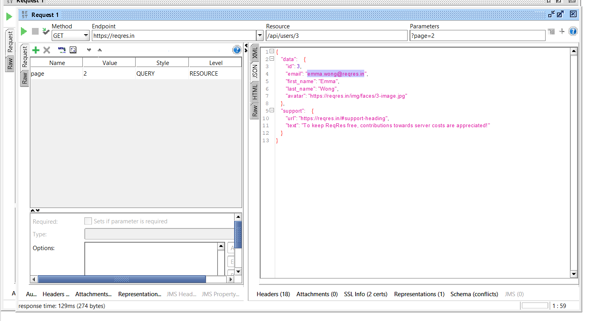
POST metodunu seçerek bu kullanıcı email bilgisi ile JSON formatında bir login oluşturuyoruz ve karşımıza bir login token'ı çıkmış oluyor
login işlemi başarılı. 
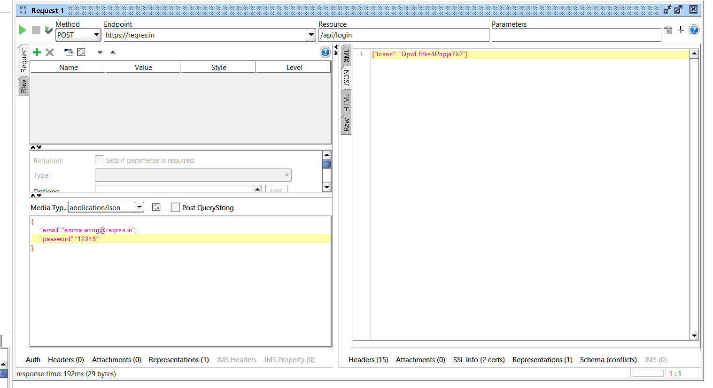

### API testimizi otomatize edelim

#### SOAP method klasörümüze sağ tıklayıp new test suit diyip, test suitmizi isimlendirelim

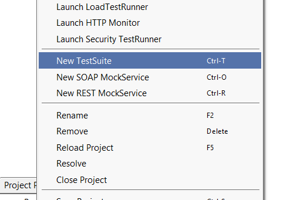 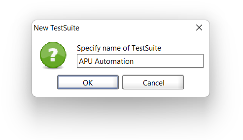

#### isimlendirdiğimiz test suitimize sağ tıklayıp testcase oluşturalım, ardından case'imize step ekleyelim.

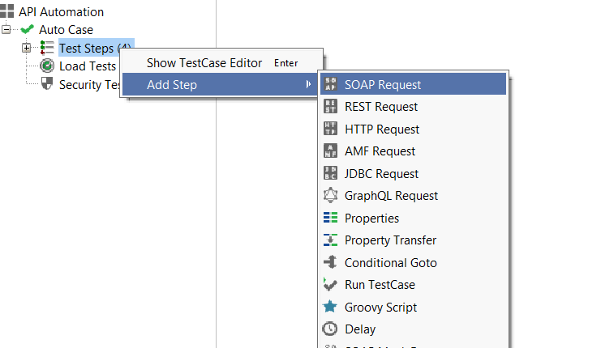

#### otomatize edeceğimiz 2 metodun adını steplerimize verebiliriz. 
- CountryISOCode
- CapitalCity
#### Ardından bir properties oluşturarak sol üst köşedeki + butonuyla bir değer setleyelim.

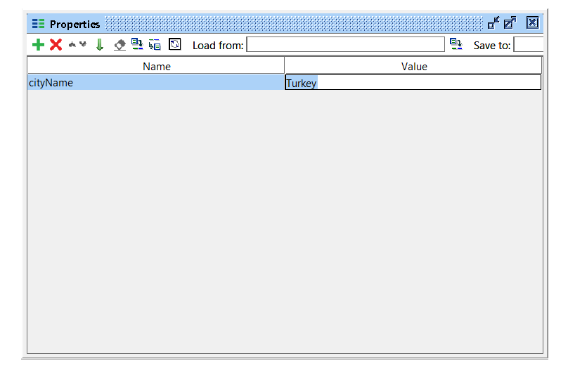

#### Oluşturduğumuz suitin içerisinde ki "CountryISOCode" otomasyon adımımıza çift tıklayıp.
    
      <web:sCountryName>?</web:sCountryName>
      soru işarteni silip sağ tıklayıp en alttaki get data kısmından 
      oluşturduğumuz properties'i setleyelim

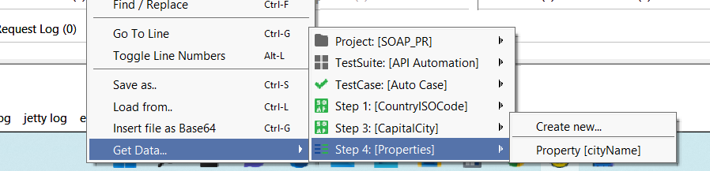

      <web:sCountryName>${Properties#cityName}</web:sCountryName>

#### Kurduğumuz yapıda oluşturduğumuz properties'i transfer amaçlı bir step oluşturalım

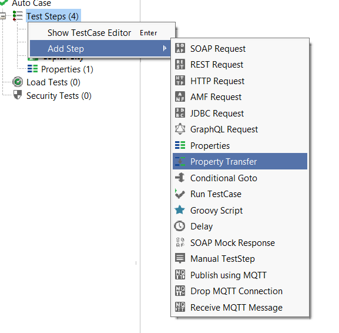

#### Properties transfer oluşturduktan sonra çift tıklayıp açılan pencerede source ve target kısımlarımı seçelim.

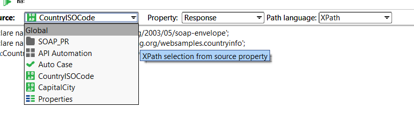 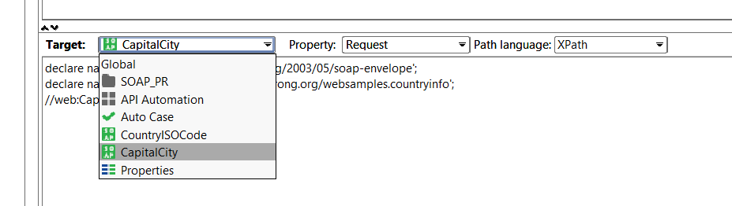

#### Bir sonraki adım olan namespace ekleme işleminide source kısmının üstünde bulunan "ns" butonuna tıklayarak sağlayalım.

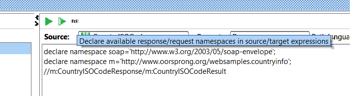

#### namespace ekledikten sonra hemen altına CountryISOCode, CapitalCity response ve result taglarını eklememiz gerekiyor.

      //m:CountryISOCodeResponse/m:CountryISOCodeResult

      //web:CapitalCity/web:sCountryISOCode

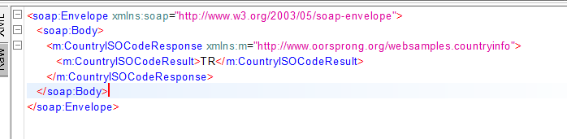
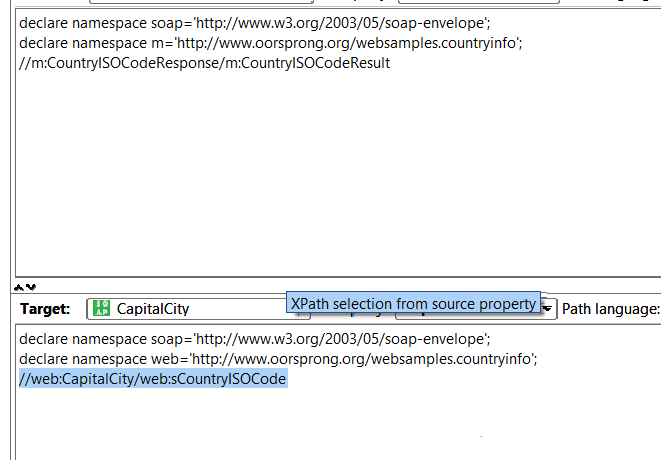

#### Şimdi testimiz koşu için hazır ,suitimize çift tıklayıp açılan pencerede play tuşuna basıp koşturalım

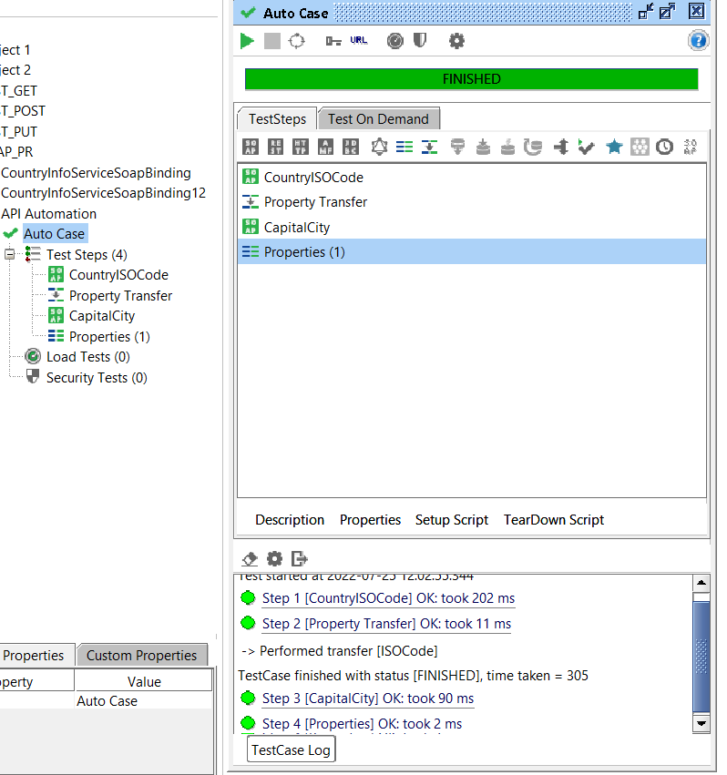

#### Görüldüğü gibi tüm adımları başarılı ise yeşil olarak gözükücektir.
#### Testinizde mevcut adımlar içersinde görmek istediğiniz değeri kontrol edebilirsiniz 
#### Bunun için CapitalCity'e çift tıklayıp sol aşşağıda assertion kısmında + butonuna basarak
#### Property content kısmından contains ekleyebilir.

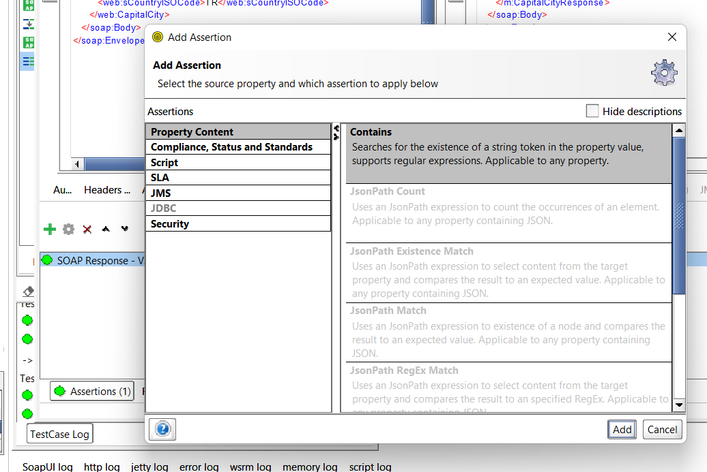

#### ve çıkan pencerede özel bir content ekleyip şart oluşturabilirsiniz.

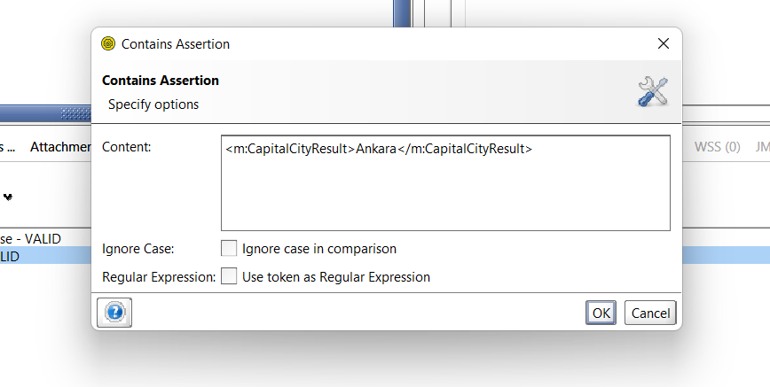

#### Bu şekilde api testimizi koşullar ekleyerek otomatize etmiş bulunduk.

